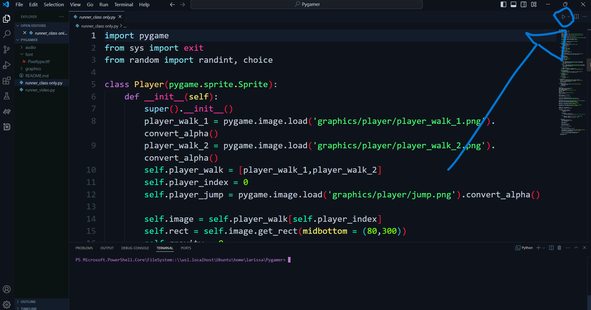

<h2>🎮 What's this project?</h2>

    Pygamer is an engaging project that leverages Python to create a fun and interactive gaming experience. 
    Explore various games and enjoy coding challenges that enhance your programming skills!

<h2>🚀 How to Run?</h2>
<pre>
    git clone https://github.com/larissadcew/Pygamer
</pre>
<pre>
    pip install pygame
</pre>

    Follow these steps to get started:

<ol>
    <li>📥 Clone the repository to your local machine:</li>
    <li>📂 Navigate to your project directory in the terminal.</li>
    <li>💻 Run the main game file using the following command:</li>
</ol>
<pre>
    pip install pygame
</pre>
<ol>
    
Press the |> button on the main menu.

</ol>

<h2>🎉 Demo:</h2>

    Check out the project on GitHub: 
    <a href="https://github.com/larissadcew/Pygamer">🌐 View Pygamer</a>

